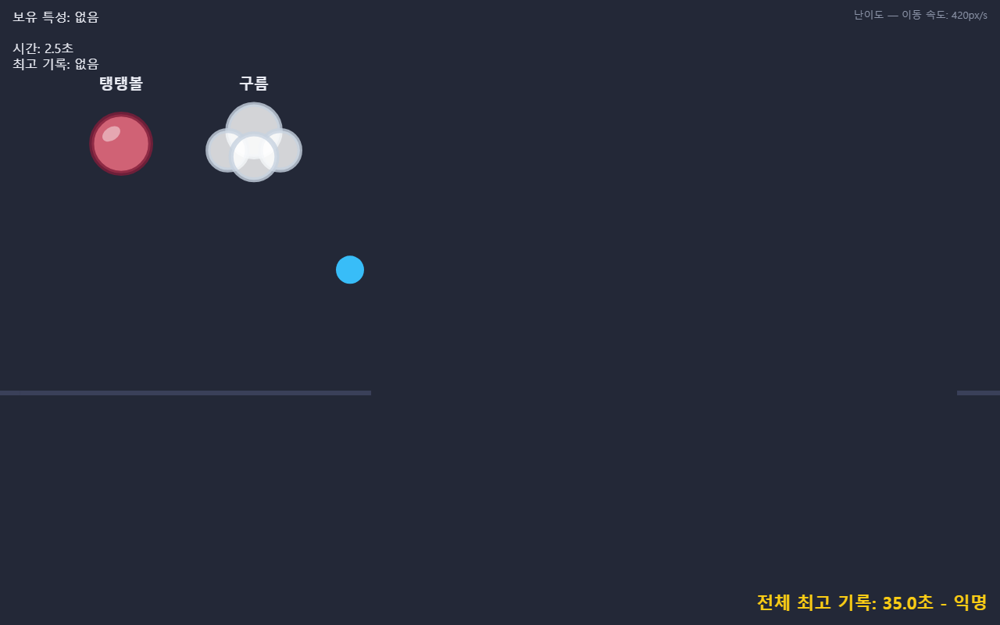

# 트리거 공 게임

공이 자동으로 계속 튀어 오르는 상태에서 좌우로 움직여 장애물을 피하고, 화면에 뜬 특성 아이콘을 클릭해 얻은 뒤 Space로 발동해 통과하는 브라우저 물리 게임입니다.

**▶ 플레이하기: https://whiteclover0542.github.io/minigame/**



## 게임 방법

1. 방향키(←/→) 또는 A/D로 공을 움직여 다가오는 장애물을 피한다.
2. 떠 있는 특성 아이콘(구름·탱탱볼·철구슬·얼음)을 마우스로 클릭해 얻고, Space로 발동해 장애물을 통과한다.
3. 초록 발판(목표)에 닿으면 클리어, 천장·구덩이·바닥에 닿으면 실패한다.

장애물은 7종류가 있으며, 매 판 그중 10개를 무작위 순서로 이어 붙인 트랙을 끝까지 통과하면 클리어입니다. 실패하면 약 1.4초 뒤 공 위치·시간·특성 상태가 전부 초기화된 새 판이 자동으로 시작됩니다.

### 특성

| 특성 | 효과 |
|---|---|
| 구름 | 중력이 약해져 멀리, 오래 활공한다 |
| 탱탱볼 | 다음 착지에서 훨씬 높이 튀어 오른다 |
| 철구슬 | 빠르게 낙하하고 거의 튕기지 않는다 |
| 얼음 | 좌우 이동 속도가 크게 빨라진다 |

## 기능

- **일시정지 메뉴** (Esc) — 게임 설명 다시 보기, 움직임 감소 켜고 끄기, 다시하기(바로 새 판 시작)
- **움직임 감소** — 실패 시 화면 흔들림 효과를 즉시 끄는 접근성 옵션
- **개인 최고 기록** — 클리어 시간을 브라우저에 저장해 재접속해도 유지
- **전체 방문자 리더보드** — Firebase Realtime Database로 전 세계 최고 기록과 닉네임을 실시간 공유 (오프라인이어도 로컬 플레이에는 영향 없음)

## 기술 스택

빌드 도구나 프레임워크 없이 순수 HTML5 Canvas와 바닐라 JavaScript로 만들었습니다. 리더보드 저장에만 Firebase Realtime Database를 사용합니다.

## 로컬에서 실행하기

빌드 과정이 없으므로 정적 파일을 그대로 서빙하면 됩니다.

```bash
git clone https://github.com/whiteclover0542/minigame.git
cd minigame
npx serve .
# 또는 python -m http.server
```

이후 안내된 주소(예: http://localhost:3000)를 브라우저로 열면 됩니다.

## 프로젝트 구조

```
index.html   진입점, Firebase SDK 로드
style.css    레이아웃/스타일
game.js      게임 루프, 물리, 렌더링, 리더보드 연동을 담은 단일 스크립트
screenshots/ 카드별 검증 스크린샷
```

## 문서

이 프로젝트는 과제 제출용으로 만들어졌으며, 과정과 근거는 아래 문서에 정리되어 있습니다.

- [최종.md](최종.md) — 제출 정리(검증 안내서, AI 활용 내역, 카드별 완료 요약)
- [ASSIGNMENT.md](ASSIGNMENT.md) — 과제 원문
- [PROGRESS.md](PROGRESS.md) — 작업 진행 기록
